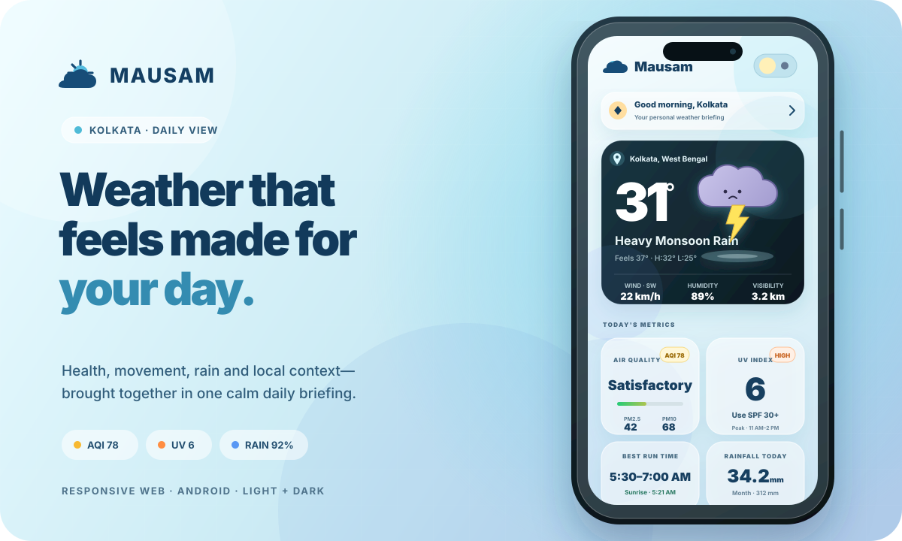

<div align="center">

# Mausam Weather

### Local weather, translated into a better day.

A mobile-first Kolkata weather experience that combines conditions, health context, movement guidance, rainfall, and local planning in one calm daily view.

[](https://react.dev/)
[](https://www.typescriptlang.org/)
[](https://vite.dev/)
[](https://capacitorjs.com/)

</div>



## What is Mausam?

Most weather apps stop at temperature and rain probability. Mausam is designed around the decisions people make after checking the weather: whether to run, carry protection, change a commute, limit outdoor exposure, water crops, or avoid swimming.

The current build is a responsive product prototype focused on Kolkata. It includes a typed weather-data contract, a safe local fallback dataset, and a configurable endpoint for connecting live conditions without rewriting the interface.

## The experience

| Area | What it provides |
| --- | --- |
| Personal setup | Name, location, body context, health sensitivities, priorities, and activity level |
| Home | Personal greeting, current conditions, animated weather companion, tailored briefing, hourly rain outlook, daily metrics, and seven-day forecast |
| Health | AQI, particulate levels, pollen, UV, humidity, heat stress, and practical health guidance |
| Forecast | Extended daily outlook, sunrise and sunset, golden-hour details, and nearby-location weather |
| Alerts | Rain warnings, waterlogging, travel disruption, and local transport context |
| Android | A Capacitor wrapper that ships the same responsive web experience as a native Android application |

## Product highlights

- Kolkata-first weather context rather than generic global summaries
- Light and dark themes with a custom animated day/night switch
- Sunny and rainy weather-card presets selected automatically from the current condition, with an optional backend override
- Animated rain-cloud companion with cloud, lightning, raindrop, and puddle motion, plus a warm sunny companion
- Clear current-weather hierarchy with location, temperature, condition, and three essential readings
- Balanced metric cards for air quality, UV exposure, best run time, and rainfall
- Practical cards for commuting, swimming conditions, gardening, and seasonal context
- Personalised guidance based on the onboarding profile
- A dedicated “Your Mausam” page with profile-prioritized insights, relevant tiles, and practical next steps
- A restrained, system-native visual hierarchy for the personalised briefing in both themes
- Touch-friendly navigation, horizontal forecast snapping, and momentum scrolling
- Responsive layout designed for phone screens first and larger screens second
- Reduced-motion support and visible keyboard focus states
- API-driven current conditions, hourly and daily forecasts, icons, AQI and UV bars, health readings, alerts, recommendations, and supporting cards

## Work completed

The interface has gone through a focused visual and usability refinement:

- Consolidated the upper dashboard into a cleaner personalised header and weather hero
- Removed unnecessary time, date, and seasonal-status clutter from the main weather card
- Reworked the weather card for stronger spacing, contrast, and information hierarchy
- Added and tuned the animated rain/storm companion without using background rain lines
- Improved weather-stat typography so values and units remain easy to scan
- Standardised the dimensions and internal alignment of the primary metric tiles
- Centred the key AQI and best-run information while preserving supporting context
- Matched the swimming and garden cards to a consistent tile system
- Corrected light-theme text and icon contrast, including the weather location marker
- Added a smoother, more expressive light/dark theme toggle
- Added a clickable personalised banner and a profile-aware “Your Mausam” briefing with deterministic health and weather priorities
- Persisted onboarding selections locally so the personalised experience survives refreshes
- Simplified the briefing header and overview with a system-native type hierarchy, fewer boxed elements, and quieter glass surfaces
- Removed full-page transform animations so long screens appear immediately without promoting the entire page to a GPU layer
- Switched to native vertical scrolling, reset new views before paint, and prevented scroll anchoring from causing position jumps
- Removed live backdrop-filter passes from mobile content cards while preserving their translucent appearance
- Isolated the animated weather companion, removed its expensive mobile SVG filter, and retained its cloud, rain, and puddle motion
- Reduced permanent compositor layers and limited mobile card transitions to lightweight transforms
- Removed external web-font requests to prevent font-loading layout shifts and use the device’s native interface font
- Added touch momentum, overscroll containment, gentle hourly-card snapping, and complete reduced-motion behaviour
- Simplified the build configuration and retained search-engine blocking in standard project files
- Moved all demonstration weather content into one typed dashboard model instead of scattering values through components
- Added partial-response merging, so backend development can replace one section at a time while unfinished fields continue to use safe demo values
- Added configurable background refresh and preserves the last valid dashboard when a request fails
- Made condition icons replaceable with emoji, public asset paths, or remote image URLs
- Made the sunny/rainy hero selection infer from `conditionCode`, with optional explicit `heroVariant` control
- Verified the production build after the UI and performance changes

## Run locally

### Requirements

- Node.js 22 or a compatible modern Node.js release
- npm

### Development

```bash
npm install
npm run dev
```

Open the local address printed by Vite. The project currently defaults to port `8443`; you can choose another port when needed:

```bash
npm run dev -- --port 5173
```

### Production build

```bash
npm run build
npm run preview
```

The optimized website is generated in `dist/`.

## Connect a weather endpoint

Copy `.env.example` to `.env.local`, then point `VITE_WEATHER_API_URL` to the backend endpoint. `VITE_WEATHER_REFRESH_MS` controls background refresh and must be at least 10 seconds.

```env
VITE_WEATHER_API_URL=http://localhost:3000/api/weather
VITE_WEATHER_REFRESH_MS=60000
```

The endpoint may return the dashboard object directly or wrap it in `{ "data": { ... } }`. During integration it may also return only the fields currently available; missing object fields are filled from the local fallback. Arrays such as `hourly`, `daily`, `alerts`, and `locations` replace their corresponding fallback arrays, so each supplied array item should be complete.

For example, this small response immediately changes the hero to rainy, updates the temperature, AQI and UV, and leaves the remaining sections on fallback data until the backend supplies them:

```json
{
  "current": {
    "temperature": 20,
    "condition": "Light Rain",
    "conditionCode": "rain",
    "heroVariant": "rainy"
  },
  "airQuality": {
    "index": 10,
    "label": "Good"
  },
  "uv": {
    "index": 5,
    "label": "Moderate"
  }
}
```

The complete TypeScript contract and fallback payload live in [`src/weatherData.ts`](./src/weatherData.ts). Forecast `icon` fields accept an emoji, a path such as `/weather-icons/rain.png`, or an HTTPS image URL. The app derives an icon from `conditionCode` when `icon` is omitted. Supported built-in codes include `sunny`, `clear`, `partly_cloudy`, `cloudy`, `overcast`, `drizzle`, `showers`, `rain`, `heavy_rain`, `thunderstorm`, `storm`, `fog`, `mist`, `wind`, and `snow`.

## Android app

Mausam uses Capacitor so the responsive website remains the single source of truth for web and Android.

```bash
# Build, sync, and open Android Studio
npm run android

# Build and sync without opening Android Studio
npm run android:sync

# Run through the Capacitor CLI
npm run android:run
```

For a release build, update the Android version code and name, run the sync command, test on a physical device or emulator, and generate a signed Android App Bundle from Android Studio. Keep signing keys and credentials outside the repository.

## Project structure

```text
.
├── android/                 Native Android project generated for Capacitor
├── docs/                    README and promotional visuals
├── public/                  Static web assets
├── src/
│   ├── App.tsx              Screens, components, onboarding, and shared-data rendering
│   ├── index.css            Themes, responsive layouts, cards, and animations
│   ├── main.tsx             React entry point
│   ├── weatherData.ts        API contract, fallback payload, icon mapping, and data loader
│   └── imports/              Local image assets
├── capacitor.config.ts      Android wrapper configuration
├── index.html               Web document shell and metadata
├── vite.config.ts           Development and production build configuration
└── package.json             Scripts and dependencies
```

## Data and persistence

- Weather, AQI, forecast, alert, health, travel, and personalised values all read from the shared model in `src/weatherData.ts`.
- With no endpoint configured, the app uses `DEMO_WEATHER_DATA` and remains fully usable.
- With an endpoint configured, a valid response updates the shared model across every screen and refreshes on the configured interval.
- Theme preference is stored locally in the browser.
- The onboarding profile and its selected weather and health concerns are stored locally on the device.
- No account, remote database, or analytics service is currently connected.

The next engineering step is to map a trusted weather provider into the documented dashboard contract and set the endpoint environment variable.

## Design principles

1. **Decision-first:** surface what the conditions mean, not only the raw numbers.
2. **Local by default:** make the experience feel written for Kolkata and its seasons.
3. **Calm density:** keep rich information readable through hierarchy and spacing.
4. **Motion with purpose:** use animation to add atmosphere and feedback without blocking interaction.
5. **One responsive product:** share the same interface and logic across web and Android.

## Current status

The responsive interface, persistent onboarding flow, personalized weather briefing, core dashboard tabs, theme system, animations, and Android wrapper are in place. The repository builds successfully with:

```bash
npm run build
```

The interface is ready for a backend to replace the fallback payload with live, location-aware weather and environmental data.
